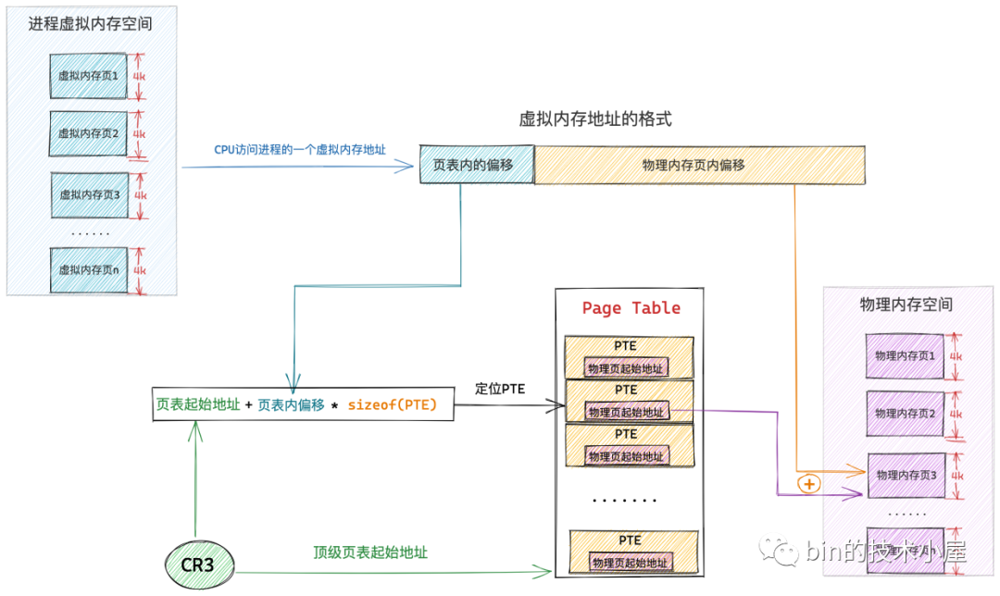

# 如何通过页表转换地址


# 页表结构
虚拟内存本身是稀疏空间，在现代系统（如 RISC-V Sv39）中，虚拟地址是 39 位，总共 512GB 空间。但实际上：
* 只使用很小一部分，如几个 MB ~ GB
* 各段（代码段、栈、堆、mmap 区等）之间存在大范围空洞

因此页表的结构是多级树状结构，以 RISC-V Sv39 为例，虚拟地址是这样拆分的：
```
VA[38:0] → VPN[2], VPN[1], VPN[0], PageOffset[11:0]
```
* 每级页表是 512 项（即 9-bit 索引）
* 页表是一棵三层树：
```
root_page_table (512 entries)
 └──-> L1 page table (on demand)
     └──-> L2 page table (on demand)
         └──-> leaf PTE → physical page
```

## 页表项(PTE)

# TLB (Table lookup buffer)