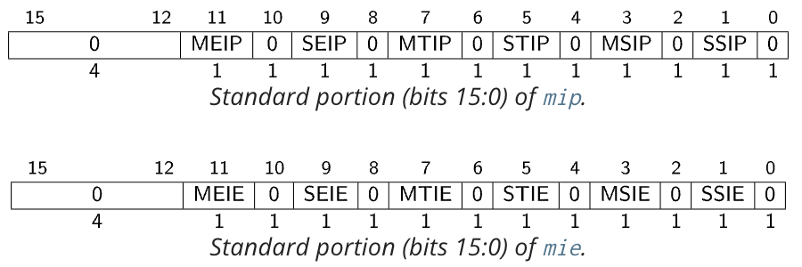

Take RISC-V as example.

# CPU Interrupt Support
Registers:
* mip / sip
* mie / sie
* mepc
* mcause
* mtval
* mtvec
* topi / topei

Hardware unit:
* APLIC
* IMSIC
* CLINT(Core-Local Interruptor), Only support timer interrupt

## mip and mie
The mip register is an MXLEN-bit read/write register containing information on pending interrupts, while mie is the corresponding MXLEN-bit read/write register containing interrupt enable bits.



## mepc
When a trap is taken into M-mode, mepc is written with the virtual address of the instruction that was interrupted or that encountered the exception.

## mcause
mcause is written with a code indicating the event that caused the trap, that is, interrupt cause number.

## mtval
When a trap is taken into M-mode, mtval is either set to zero or written with exception-specific information to assist software in handling the trap.

## mtvec
The mtvec register is an MXLEN-bit WARL read/write register that holds trap vector configuration, consisting of a vector base address (BASE) and a vector mode (MODE).

# IRQ (Interrupt Request)

## IPI (Interprocessor Interrupt)

# Kernel handling
## Configuration
```
cat /proc/interrupts
```