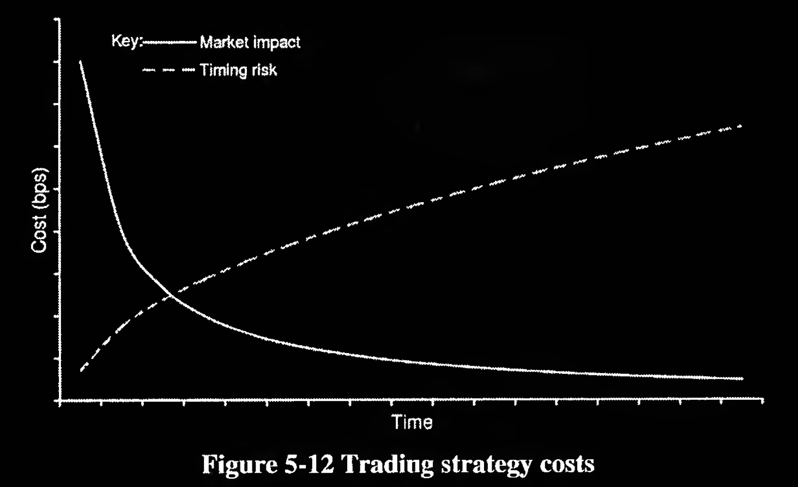

The algorithms that how to complete your orders.

# 分类
根据算法设计时对市场影响、执行成本、风险容忍度的不同权衡：
* Schedule-driven 按照预先设定的时间表或成交曲线（如 VWAP、TWAP、POV）执行交易，几乎不考虑市场条件
* Evaluative 基于对当前市场条件的评估（如流动性、价格趋势、订单簿状态），动态决定是否/何时/以什么方式执行交易
* Opportunistic 专门寻找市场中的“短暂机会”（如误价、流动性突现、大单遮掩等），在最优时机快速执行

从策略的目标导向角度来看的，重点是它们试图最优化的执行目标是什么：
* Impact-driven 控制交易对市场的冲击，避免“踩出价格”，从而最大限度保护隐蔽性与执行稳定性
* Cost-driven 主要目标是最小化交易成本，包括显性费用和隐性滑点
* Opportunistic 捕捉市场中的短暂机会，以低成本成交或获得信息优势

# Impact-driven Algorithms
## VWAP (Volume Weighted Average Price)
VWAP 策略试图让你的成交均价尽可能接近当天市场的成交量加权平均价格（VWAP）

# Cost-driven Algorithms

## Implementation Shortfall Algorithm
Implementation Shortfall 是执行交易的最终实际成本与理想基准价格（决策时刻的市场价格）之间的差距。

IS 策略试图最小化执行价格与决策价格之间的偏差，即尽快成交但不引发不必要的成本

## Adaptive Shortfall Algorithm
Adaptive Shortfall 策略是一种动态调整的 IS 策略，它会根据实时市场条件（价格、成交量等）不断调整执行速度和下单计划，以更好地控制交易成本和市场冲击

## Market close algorithm
Market Close Algorithm 是一种专门设计用来在市场收盘前执行订单的交易算法，目标是尽量接近收盘价完成大宗交易，从而降低“价格偏离风险”和“执行影响”

# Opportunistic algorithms
## Price inline
根据当前市场价格位置动态调整订单执行速度的算法，目标是 只在价格合理（即“在线”）时积极执行，价格不利时就收敛等待，避免冲击和滑点

## Liquidity-Driven Algorithm
一种根据市场实时流动性状况动态决定下单时机和数量的交易算法，目标是利用市场中自然出现的流动性完成交易，而不是推动市场成交

## Pair trading
一种统计套利策略，通过同时做多一只资产、做空另一只相关资产，来从它们之间的价格关系中获利，而非依赖于单一资产的涨跌

# Other algorithms
## Multi-leg
指涉及两种及以上证券、方向或到期日的组合型交易策略，通常要求这些“腿”（legs）同时下单、同时成交以控制风险或实现套利

## Volatility-driven
基于市场波动率水平或预期变化来制定交易计划的策略类型，核心思想是从波动性本身中获得利润，而非价格方向

## Gamma Weighted Average Price
一种考虑组合 Gamma 敞口、动态调整交易节奏的算法执行策略，其目标是在市场交易期间，使成交分布与Gamma 敏感性曲线相匹配，从而优化对冲、降低交易影响和成本

# Appendix
名词解释：
* Trade Horizon 交易时间窗口