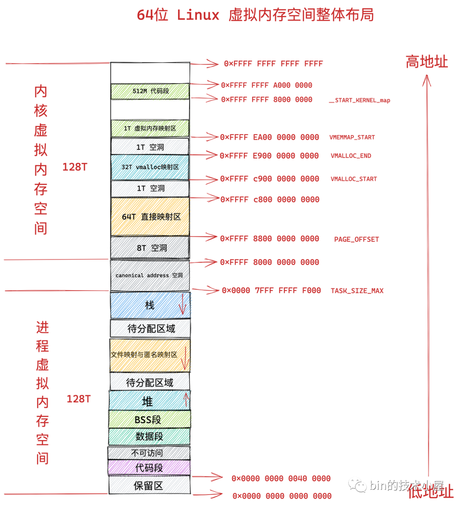
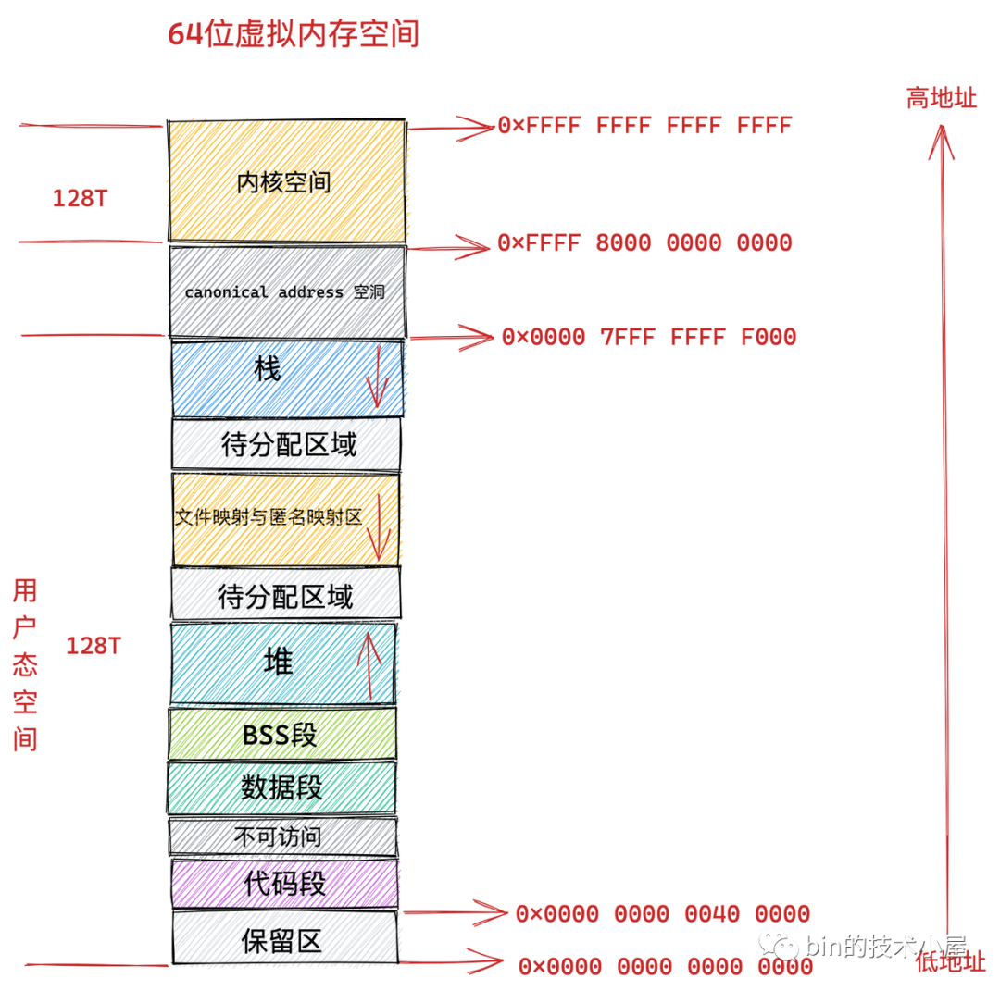
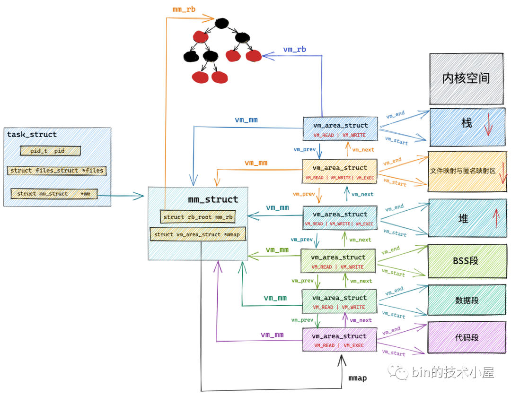

# 程序的典型内存布局
* 完整的内存空间布局

* 用户空间内存布局

# 内存映射管理

## task_struct 结构体

## mm_struct 结构体
mm_struct 描述了一个进程（或线程组）拥有的全部虚拟地址空间，包含页表、虚拟内存区域（VMA）链表/红黑树、栈、堆、mmap 区、代码段等的组织信息，是 Linux 内核中用户地址空间的“总管”。

## vm_area_struct 结构体
这是 Linux 用来管理虚拟地址空间中某一段连续区域的核心数据结构。

# 内存分配过程（malloc发生了什么）