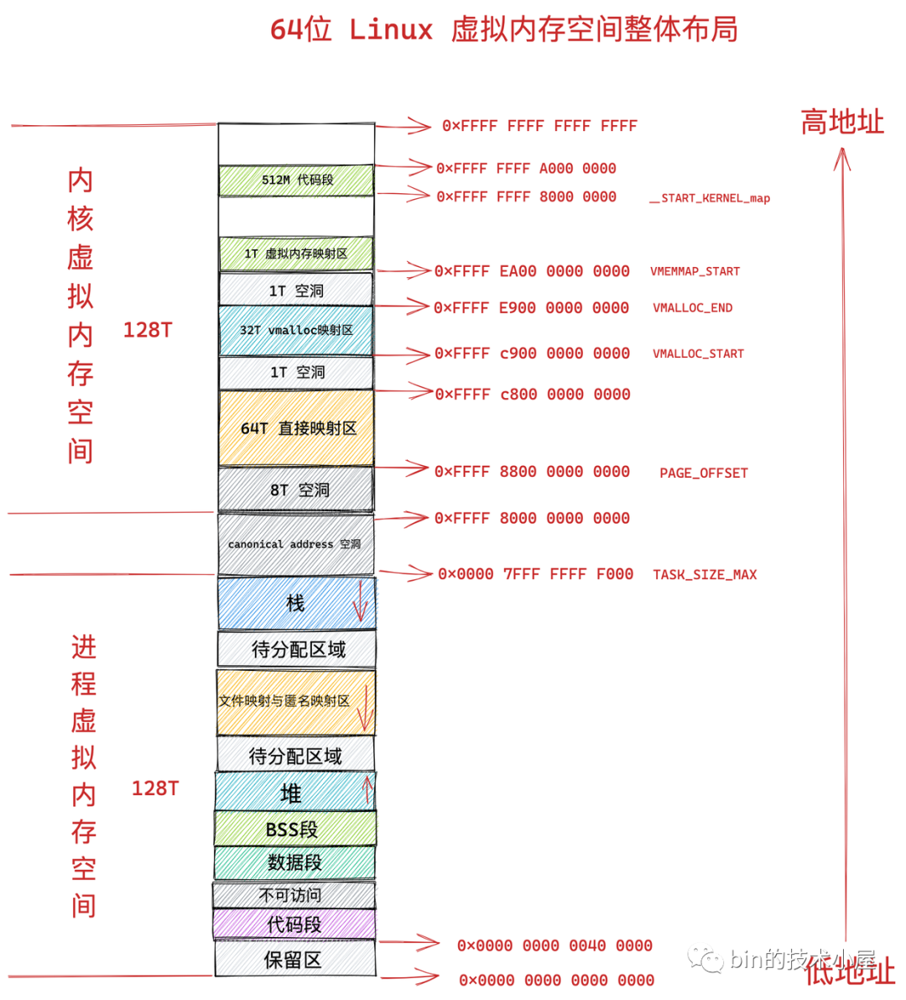

# 概述

虚拟内存区域（Virtual Memory Area, VMA）是 Linux 内核中管理进程虚拟地址空间的核心概念。每个进程的虚拟地址空间被划分为多个 VMA，每个 VMA 代表一段连续的虚拟地址范围，具有相同的访问权限和属性。

# 程序的典型内存布局

## 完整的内存空间布局
Linux 系统中，每个进程都有独立的虚拟地址空间，通常为 4GB（32位）或 128TB（64位）。



## 用户空间内存布局
用户空间通常从地址 0x00000000 开始，包含以下主要区域：


- **代码段（Text Segment）**：存放可执行代码
- **数据段（Data Segment）**：存放全局变量和静态变量
- **BSS 段**：存放未初始化的全局变量
- **堆（Heap）**：动态分配的内存区域
- **共享库区域**：映射的共享库
- **栈（Stack）**：函数调用栈和局部变量
- **mmap 区域**：内存映射文件

# 内存映射管理架构


## task_struct 结构体

`task_struct` 是 Linux 内核中表示进程的核心数据结构，其中包含指向内存管理结构的指针：

```c
struct task_struct {
    // ... 其他字段 ...
    struct mm_struct *mm;        // 指向内存描述符
    struct mm_struct *active_mm; // 活跃的内存描述符
    // ... 其他字段 ...
};
```

## mm_struct 结构体

`mm_struct` 描述了一个进程（或线程组）拥有的全部虚拟地址空间，是 Linux 内核中用户地址空间的"总管"：

```c
struct mm_struct {
    struct vm_area_struct *mmap;        // VMA 链表头
    struct rb_root mm_rb;               // VMA 红黑树根
    unsigned long mmap_base;            // mmap 区域基地址
    unsigned long start_code, end_code; // 代码段范围
    unsigned long start_data, end_data; // 数据段范围
    unsigned long start_brk, brk;       // 堆区域范围
    unsigned long start_stack;          // 栈起始地址
    unsigned long arg_start, arg_end;   // 参数区域
    unsigned long env_start, env_end;   // 环境变量区域
    // ... 其他字段 ...
};
```

主要功能：
- 管理页表（Page Tables）
- 维护 VMA 链表和红黑树
- 跟踪各个内存段的边界
- 管理内存映射

## vm_area_struct 结构体

`vm_area_struct` 是 Linux 用来管理虚拟地址空间中某一段连续区域的核心数据结构：

```c
struct vm_area_struct {
    unsigned long vm_start;     // 区域起始地址
    unsigned long vm_end;       // 区域结束地址（下一个字节）
    
    struct mm_struct *vm_mm;    // 所属的内存描述符
    pgprot_t vm_page_prot;     // 页面保护属性
    unsigned long vm_flags;     // 区域标志
    
    struct rb_node vm_rb;      // 红黑树节点
    struct list_head vm_list;  // 链表节点
    
    const struct vm_operations_struct *vm_ops; // 操作函数集
    struct file *vm_file;      // 映射的文件（如果有）
    void *vm_private_data;     // 私有数据
    // ... 其他字段 ...
};
```

### VMA 标志位（vm_flags）

```c
#define VM_READ     0x00000001  // 可读
#define VM_WRITE    0x00000002  // 可写
#define VM_EXEC     0x00000004  // 可执行
#define VM_SHARED   0x00000008  // 共享
#define VM_MAYREAD  0x00000010  // 可能可读
#define VM_MAYWRITE 0x00000020  // 可能可写
#define VM_MAYEXEC  0x00000040  // 可能可执行
#define VM_GROWSDOWN 0x00000100 // 向下增长（栈）
#define VM_GROWSUP  0x00000200  // 向上增长（堆）
```

### VMA 操作函数集

```c
struct vm_operations_struct {
    void (*open)(struct vm_area_struct *area);
    void (*close)(struct vm_area_struct *area);
    int (*fault)(struct vm_area_struct *vma, struct vm_fault *vmf);
    int (*page_mkwrite)(struct vm_area_struct *vma, struct vm_fault *vmf);
    int (*access)(struct vm_area_struct *vma, unsigned long addr,
                  void *buf, int len, int write);
    // ... 其他操作函数 ...
};
```

# VMA 的组织方式

## 链表组织
VMA 通过 `vm_list` 字段组织成双向链表，便于遍历所有 VMA：

```c
// 遍历所有 VMA
struct vm_area_struct *vma;
list_for_each_entry(vma, &mm->mmap, vm_list) {
    printk("VMA: %lx-%lx\n", vma->vm_start, vma->vm_end);
}
```

## 红黑树组织
VMA 通过 `vm_rb` 字段组织成红黑树，便于快速查找特定地址所在的 VMA：

```c
// 查找地址 addr 所在的 VMA
struct vm_area_struct *find_vma(struct mm_struct *mm, unsigned long addr)
{
    struct rb_node *rb_node;
    struct vm_area_struct *vma;
    
    rb_node = mm->mm_rb.rb_node;
    while (rb_node) {
        vma = rb_entry(rb_node, struct vm_area_struct, vm_rb);
        if (addr < vma->vm_start)
            rb_node = rb_node->rb_left;
        else if (addr >= vma->vm_end)
            rb_node = rb_node->rb_right;
        else
            return vma;
    }
    return NULL;
}
```

# 内存分配过程（malloc 发生了什么）

## 1. 用户空间调用 malloc

```c
void *ptr = malloc(1024);  // 分配 1KB 内存
```

## 2. 系统调用 brk/sbrk

对于小块内存，glibc 使用 `brk` 系统调用调整堆边界：

```c
#include <unistd.h>
int brk(void *addr);
void *sbrk(intptr_t increment);
```

## 3. 系统调用 mmap

对于大块内存，glibc 使用 `mmap` 系统调用：

```c
#include <sys/mman.h>
void *mmap(void *addr, size_t length, int prot, int flags,
           int fd, off_t offset);
```

## 4. 内核处理

内核收到系统调用后：

1. **验证参数**：检查地址范围、权限等
2. **查找 VMA**：确定新区域与现有 VMA 的关系
3. **创建/修改 VMA**：分配 `vm_area_struct` 结构体
4. **更新页表**：建立虚拟地址到物理地址的映射
5. **返回结果**：返回虚拟地址给用户空间

## 5. VMA 合并

内核会尝试合并相邻的、具有相同属性的 VMA：

```c
// 伪代码：VMA 合并逻辑
if (vma->vm_end == next_vma->vm_start &&
    vma->vm_flags == next_vma->vm_flags &&
    vma->vm_file == next_vma->vm_file) {
    // 合并两个 VMA
    vma->vm_end = next_vma->vm_end;
    remove_vma(next_vma);
}
```

# 实际应用示例

## 查看进程的 VMA 信息

```bash
# 查看进程的内存映射
cat /proc/$$/maps

# 输出示例：
# 00400000-00401000 r-xp 00000000 08:01 123456 /bin/bash
# 00600000-00601000 rw-p 00000000 08:01 123456 /bin/bash
# 7fff12340000-7fff12360000 rw-p 00000000 00:00 0 [stack]
```

## 程序示例：创建和使用 VMA

```c
#include <stdio.h>
#include <sys/mman.h>
#include <unistd.h>

int main() {
    // 创建匿名映射（相当于分配内存）
    void *addr = mmap(NULL, 4096, PROT_READ | PROT_WRITE,
                      MAP_PRIVATE | MAP_ANONYMOUS, -1, 0);
    
    if (addr == MAP_FAILED) {
        perror("mmap failed");
        return 1;
    }
    
    // 使用分配的内存
    sprintf(addr, "Hello, VMA!");
    printf("Content: %s\n", (char*)addr);
    
    // 释放内存
    munmap(addr, 4096);
    return 0;
}
```

# 性能考虑

## VMA 数量对性能的影响

- **VMA 过多**：增加查找时间，影响内存分配性能
- **VMA 过少**：可能导致内存碎片，降低内存利用率

## 优化建议

1. **合理使用内存池**：减少频繁的小内存分配
2. **批量操作**：尽量一次性分配大块内存
3. **及时释放**：避免内存泄漏和 VMA 碎片

# 总结

虚拟内存区域（VMA）是 Linux 内存管理的核心概念，它：

- 提供了灵活的内存管理机制
- 支持多种内存映射方式
- 通过链表和红黑树实现高效的组织和查找
- 为进程提供了统一的虚拟地址空间抽象

---

**参考资料：**
- Linux 内核源码：`include/linux/mm_types.h`
- 《Understanding the Linux Virtual Memory Manager》
- 《Professional Linux Kernel Architecture》
